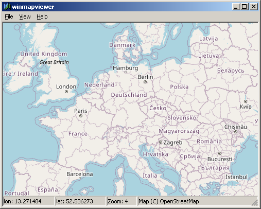

# winmapviewer 

winmapviewer is a free minimalistic viewer for [OpenStreetMap](https://www.openstreetmap.org/) raster tile maps. It's written using the Win32 API and runs on systems with Windows 95 and above.

## Features

- Four presets for well-known OpenStreetMap styles
- Custom tile URL templates for using any [compatible map source](https://wiki.openstreetmap.org/wiki/Raster_tile_providers)
- Location search powered by the [Nominatim geocoding API](https://nominatim.org/)
- Printing of current map position
- Multiple map windows to view different locations, zoom levels and/or map styles simultaneously

### Disabling TLS

When running winmapviewer on older versions of Windows it may be necessary to use insecure HTTP for fetching the tiles.
This is possible by toggling *View* - *Style* - *Use secure connection (TLS)*.

## System requirements
- Windows 95 or later (or Linux with Wine)
- 133 MHz processor, 32 MB RAM (when using Windows 95)

## Building

### Linux / MinGW

Install `g++-mingw-w64` and run `make`.

### Visual C++ 6

Open the workspace winmapviewer.dsw and select Build - Build all.

### Devcontainer

A devcontainer configuration is supplied for compiling using MinGW.

## Authors

Stefan Schramm (<mail@stefanschramm.net>)

## License

[MIT](https://opensource.org/license/MIT)

Permission is hereby granted, free of charge, to any person obtaining a copy of this software and associated documentation files (the "Software"), to deal in the Software without restriction, including without limitation the rights to use, copy, modify, merge, publish, distribute, sublicense, and/or sell copies of the Software, and to permit persons to whom the Software is furnished to do so, subject to the following conditions:

The above copyright notice and this permission notice shall be included in all copies or substantial portions of the Software.

THE SOFTWARE IS PROVIDED "AS IS", WITHOUT WARRANTY OF ANY KIND, EXPRESS OR IMPLIED, INCLUDING BUT NOT LIMITED TO THE WARRANTIES OF MERCHANTABILITY, FITNESS FOR A PARTICULAR PURPOSE AND NONINFRINGEMENT. IN NO EVENT SHALL THE AUTHORS OR COPYRIGHT HOLDERS BE LIABLE FOR ANY CLAIM, DAMAGES OR OTHER LIABILITY, WHETHER IN AN ACTION OF CONTRACT, TORT OR OTHERWISE, ARISING FROM, OUT OF OR IN CONNECTION WITH THE SOFTWARE OR THE USE OR OTHER DEALINGS IN THE SOFTWARE.
