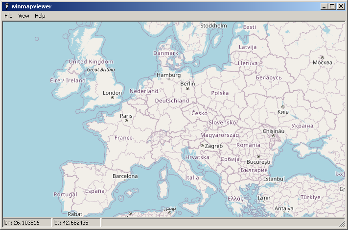

# winmapviewer

Just a minimalistic OpenStreetMap viewer application as playground for usage of the Win32 API.

Map data from [OpenStreetMap](https://www.openstreetmap.org/copyright)

## Building

Open the workspace winmapviewer.dsw in Visual C++ 6 and select Build - Build all.

## Running under Windows 95/98

The program makes use of GDI+ to decode the map tile PNGs.

GDI+ was introduced in Windows XP, but you can download ["Platform SDK Redistributable: GDI+"](https://archive.org/download/gdiplus_dnld) and place the gdiplus.dll next to winmapviewer.exe to use it under Windows 9x.

## Notes

The map files are fetched using unencrypted HTTP.

## Authors

Stefan Schramm (<mail@stefanschramm.net>)

## License

[GPLv3](https://www.gnu.org/licenses/gpl-3.0)
